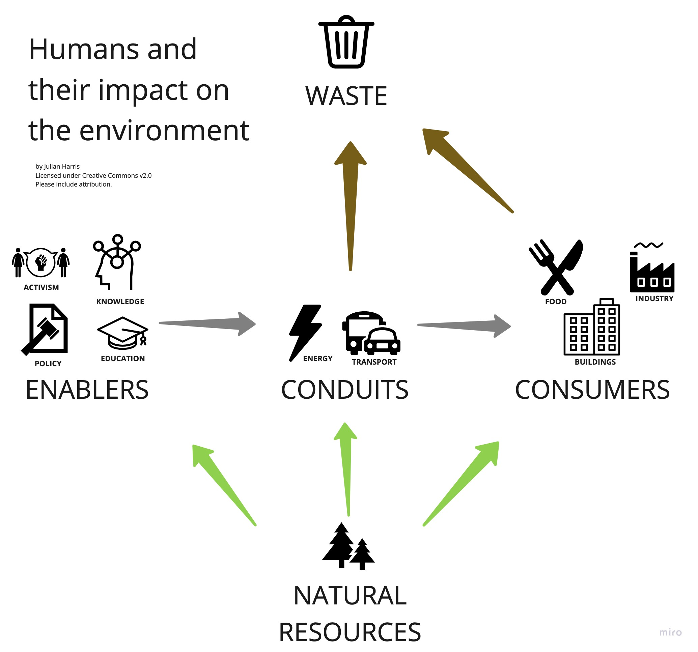

# Reasons for Hope Nov 29, 2020: Q: which are now 100% green energy: Tasmania, Costa Rica, Scotland, Iceland?

A: all of them! More later on this. 

*This is a long-form read. I consider it a great privilege if you take the time to read this.* 

*My promise is that it will be a fun, inspiring, and valuable update.*

*I do this in my own time because I think the world needs a plase to keep up to speed with climate crisis progress without fear of anxiety or guilt.*

# And so I begin.
**People don't like change, and that's why policies are so important to enable change at scale.**

"I'm going to spontaneously sacrifice my lifestyle so the planet is better". -- *said almost no one ever*

This just doesn't generally happen spontaneously. It's not my place to judge this but to talk about why something often yawningly tedious like "government policy" is so critical. 

Policy enables things at scale. It can set a level playing field so that eco-friendly "just makes business sense", and makes it easy for people to do the right thing. 

I bring this up because this edition has some very interesting policy news from a variety of fronts. 

Here's my flawed and incomplete framework I use for representing the different ways humans impact the environment (for good or bad):

# A word from me: no more UK Govt "promises"
*Another update to my veto list: I'm really sick of the current UK govt climate announcements.  The current UK PM is a showman, loves a good story and even as politicians go, has a particularly poor reputation for delivering on promises. I will enthusiastically report on real impact: sadly though, they will need to be verified independently. This is a channel of hope, but I draw the line at unreliable sources of consistently false hope. PS [Spitting Image's rendition of Johnson is epicly good](https://www.youtube.com/watch?v=2SP1dV7AZ8M)*

# Policy [14 countries agree to 100% sustainability ocean usage](https://flip.it/9u425z)
The countries are Australia, Canada, Chile, Ghana, Indonesia, Japan, Kenya, Mexico, Namibia, Norway, Portugal, and the island nations of Fiji, Jamaica, and Palau. Yep -- JAPAN! Will we finally be able to save the whales?

More
- ["Paris effect" has led to unexpected shift towards low-carbon economy](https://flip.it/FrySVz): mostly due to the huge drop in the cost of solar and wind power.
- [US: The Making of Biden's Superfast push for clean energy](https://flip.it/Fu-6gr). 28% of US emissions are from the grid, and Biden appears to be pushing to reduce that to zero, fast. 
- [US: Trillion Trees Bill](https://flip.it/zNan86) brings bipartisan focus on ways to enable the land and sea absorb carbon naturally ("natural carbon sequestration"). 
- [Five years on, signs that the Paris Climate Accord is working](https://flip.it/uyJgok): if the 127 nations pledging to go to net-zero carbon emissions actually do it, warming would only be 2.1 degrees (3.8 degrees Fahrenheit)"
- [Danish climate minister shutting down the oil industry "for good"](https://flip.it/7ITnuQ)
- [Japan to eliminate petrol cars by 2030](https://flip.it/53lF2H)

# Activism: [the youth holds their own climate summity in lieu of COP26](https://flip.it/sJiOcd)

Plan is to influence the shape of the "real" COP26 including fairer representation and provoke discussion of critical issues that might otherwise be misse.d 

# Finance & Investment: [Bill Gates launches $35bn funding for US leadership on climate change](https://flip.it/rqA0C7)

> “[We] need to revolutionize the world’s physical economy—and that will take, among other things, a dramatic infusion of ingenuity, funding, and focus from the federal government. No one else has the resources to drive the research we need,”

# Waste: [waste plastic as sand substitute](https://flip.it/Cq_FY2)

Another use for unrecyclable plastic: mixing it in with sand for construction being done in a pilot plant in Cape Town. If you thought there was a lot of plastic waste, get this: reducing construction industry sand consumption by only 2.8% would "absorb all the plastic on earth". 

I never thought I'd be so astonished by concrete.

Also there's a sand shortage because construction needs a kind of smooth even sand that can't come from just anywhere, so there's that too. 

Looking forward to seeing how they can scale this effectively: collecting plastic waste from beaches, processing it cost-effectively and with minimal-to-zero carbon emissions…

# Energy

Batteries have four things that really matter:
- Operating temperature. No use having a battery that flakes out when "things get a bit chilly" (I'm looking at YOU iPhone 6S Plus). 
- Well actually the others are pretty obvious: capacity, charge speed and lifespan. Oh and it's a plus if it doesn't blow up easily.

Couple of news bites below giving me hope that the steady and rapid march towards better batteries is finally well under way. 

More
- [Backed by Bill Gates, QuantumScape invents game-changing new battery](https://flip.it/2z07mn). First practical "Lithium-Metal" battery charges to 80% in 15 minutes. It's kind of a big deal: the battery tech earned its inventor the Nobel Price in chemistry in 2019, and the results apparently blow away what people in the know thought possible with solid-state (vs liquid) batteries. It's a some years away though. [See video "what are solid-state lithium metal batteries?](https://www.youtube.com/watch?v=azACL3lLMo8&feature=emb_title)

-  which is why Toyota's announcement is interesting: - [Toyota electric vehical launch in 2021](https://flip.it/2B.D2z): 10 minute charging a solid state battery for 300 mi capacity. If this is truly the case then they are lightyears ahead of state-of-the-art and should probably spin out the tech to sell to … the rest of the automotive world. 

- [Aptera is a solar-powered car, claims it never needs charging](https://flip.it/wOyf_3)

- [Apple cofounder Steve Wozniak launches blockchain startup Efforce](https://flip.it/wOyf_3) for energy-efficient fundraising projects. *Geek note: fingers crossed it's not using electricity-hungry "proof of stake" consensus mechanism!*

- [Another energy source invented](https://flip.it/An8fky): new material can store energy for potentially years and emit it as heat. Welcome to the world, DMOF1!

- [Tasmania becomes 100% powered by renewable electricity](https://flip.it/sA7-W5): they're not going to stop there, targeting 200% capacity by 2040. I learnt also that Costa Rica, Scotland and Iceland are also now 100% renewable. Iceland I can understand: Scotland is impressive!

# Consumption: [IKEA now does entire "tiny" homes](https://flip.it/QbFod5)
Said to be catering to the American "tiny house" movement. 

Also:
- I heard that the packaging industry was undergoing a bit of a transformation: this article listing [7 ways packaging is being transformed](https://flip.it/h6V8vO) is wonderfully hopeful. Of note, "invisible barcodes" to help automated sorting of recycling materials. 
- [Singapore first country to approve consumption of entirely artificial meat](https://flip.it/oN-qF4)
- [Future staples?](https://flip.it/gr5L7M) Oysters, mussels and other bivalves can combat algal blooms and are actually incredibly healthy and can be farmed cheaply. 

# More thoughts?
Feedback please feel to comment here or mail julian.harris+rfh@gmail.com 

# Now in email form!
This newsletter is part of the LinkedIn Newsletter pilot. If you'd like to get this in your inbox, I also share the newsletter on http://reasonsforhope.substack.com. 

