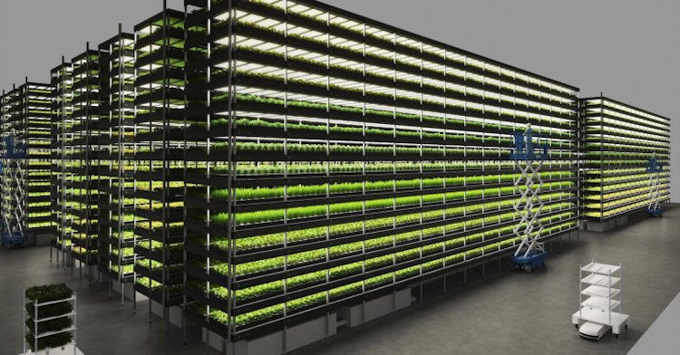

# Reasons for Hope Sun 27 Dec 2020

Injecting CO2 into concrete, jet fuel + find out why car markers are freaking out. 

*Photo: A wind-powered vertical farm in Denmark*

Seasons Greetings to y'all! My Christmas tree this year also I hope to be my last as it's a live tree that I put in a pot and will grow outside afterwards! 

It's not only a carbon sink by continuing to absorb CO2 but will save the need for consumption of future trees for the next 10-20 years! 

(Here in the UK they're basically the same price as a cut down one too.)

<em>You're receiving this I'm hoping because you **want to keep up to date with the climate crisis**, but <b>want an anxiety-free experience</b>.</em>

I created Reasons for Hope for my own desire to an anxiety-free resource: all the other newsletters were a mixed bag: you'd never know whether you'd end up getting all stressed out by some new misery to worry about. I like to choose the flavours of my chocolates!

<em>If you know of others who might like this, please forward it to them or send them this link. My email newsletter is getting a 77% open rate. I'm pretty astonished: it's almost unheard of in newsletter circles, so you can be confident to recommend it to others resting assured they'll find it a joy to read.</em>

# Reasons for Hope Now on YouTube!

I'm exploring ways to reach out to more people. I've created a YouTube Playlist that has most of the videos I have referred to.

What a year! Which makes how it's ending even more amazing! Onward a hugely prosperous and fulfilling 2021 for you all. 

[Reasons for Hope YouTube Playlist](https://youtube.com/playlist?list=PLoeAkrwPmcTFlKewSw-4oOUuwW_s-DXqu) 

# "It just makes business sense".

 I wrote about this last time: the only real catalyst that capitalist societies have is policy and compeititon. 
 
 So if we're to save the planet, we need the right policies to spur the right competition. 
 
 Just two weeks pass and there's evidence that things are changing for the good of all in so many areas. 

**Cars for example.** Imagine you're a car-maker in Dec 2020. What are you going to bet your future on: diesel and petrol, or electic? As a hint, legislation in a growing number of countries is banning petrol and diesel vehicles outright, in timeframes that for car manufacturers with their 10 year lead time are pretty hair-raising. Would you be other countries don't follow suit in the next year or two? 

I'm walking down the street with my 6 & 10 year-olds and pointing at the cars, saying to my youngest **"by the time you're 16, these noisy polluting cars will seem as strange as steam engines"**. 

# Natural Resources

* Planting trees sound good, but actually, [it's often best to just leave the forest to do its job](https://flip.it/dwalYw).

* How do you measure the impact of the changes made to farmland? Soil samples are slow. What if radar is enough? [Ground-penetrating radar, a decades-old tech, looks to have promising applications to look at non-invasive soil sampling methods](https://flip.it/91YtWT). 

# Policy

Japan makes [gas-powered cars illegal by 2035](https://flip.it/.x_ZaU). #tippingpoint

[US Covid-19 relief package bundles a bunch of climate policies in it!](https://flip.it/CLBSud) Nice. This has been dubbed by the Clean Air Taskforce as **"The most significant climate legislation ever"** (at least in the US). 

This matters for people outside the US because the US has been surprisingly lackadaisical regarding climate change and this is an important world-stage event. 

World Economic Forum: **["6 reasons why we're ready to tackle climate change"](https://flip.it/saIf8u)**. Regular readers won't see much new here:

1. **Over 1,000 big companies pledged major emissions reductions**
2. **Major cities are improving urban life while building climate resilience**
3. **Financial institutions recognize that funding fossil fuels is a bad investment**
4. **Technological advances make renewable energy and other solutions more attainable**
5. **Expanding social movements reflect the public’s growing demand for climate action**
6. **Country-level action Is starting to accelerate**

# Activism

Bill Gates' book "[How To Avoid A Climate Disaster"](https://flip.it/vaB9DG) is out in Feb. 

Veganuary is on again: if you're interested in trying a plant-based diet for Jan 2021, [here's a useful video on how to try it](https://www.youtube.com/watch?v=b60YgdoVHWg). 

 **What's really different this year is that [100+ celebrities are going beyond that and committing to go on a plant-based diet for the whole of 2021](https://flip.it/1Ae1ZK). **

BTW: I'm not going to turn this newsletter into a vegan advocacy pulpit. The important thing is that big name influencers like Paul McCartney, Ricky Gervais and a 90+ others are increasing awareness of climate change at a huge scale. This can catalyse a tipping point. 

*(PS if you live in East London I'm jealous: I'm pretty sure I'd be vegan if I lived there, the vegan restaurants are truly amazing. Sadly less so in South London where I am.)*

# Transport

* Apple appears to be renewing its [plans in an Apple Car](https://flip.it/eJyHU8) with rumours to hit 2024.

* [10 electric cars for less than $US9000](https://www.youtube.com/watch?v=7NnJMlD3IV8&feature=share)

# Energy

* [The price of electric car batteries has dropped 89% in 10 years](https://flip.it/1VJEBK). And as you will have read here in past issues, it's just getting better. 

* Meanwhile, Green Hydrogen as another fuel of the future is "[set for 50x expansion](https://flip.it/NGUxg5)". 

* An amazing video on wind turbines ["How big can wind turbines get?"](https://flip.it/9vi_KH). Extraordinary engineering going into them. 
* How big can a wind turbine get? Try 86 stories high big

# Consumption

* [One company's path to carbon neutrality](https://flip.it/tsM6k5). Lessons learned and other advice from Signify.

* [Two inventions inspired by plant leaves that are helping create food from light and air](https://flip.it/RpSaq4)

* [Hempcrete](https://flip.it/t3CmXg): carbon-negative building materials that have great self-regulating insulation. [Watch: how to make Hempcrete](https://www.youtube.com/watch?v=9d_wsoZS6j0)

* Also maybe we can just [stick the carbon dioxide directly into the concrete](https://flip.it/_KzdqL)? 

* If there's any left over (the construction industry is HUUGE), then now they're finding ways to stick CO2 into fuel! The process from a team at Oxford University [uses cheap iron catalysts to capture CO2 from the air and converts it into fuel for aeroplanes](https://flip.it/N.CJFo).

* [Danish wind-powered vertical farm provides 1000s of tonnes of food annually](https://flip.it/Zxcj_W)

* [5 ways solar energy could help power the future](https://flip.it/-CGRm-) (for real this time). Did you know solar panels don't actually like much heat? Amazing.

* [Debunking renewable energy myths](https://www.youtube.com/watch?v=bC-BYhuFUtY&feature=share): a very accessible and informative 13 min video on misinformation surrounding renewable energy (and what the reality is). 

# Waste

* [Creating vertical gardens from waste plastic](https://flip.it/dBNIvX)

* [EU bans shipping plastic waste to developing nations](https://flip.it/2sxhpz). About time too. 

# More thoughts?
Feedback please feel to comment here or mail julian.harris+rfh@gmail.com 

# Now in email form!
This newsletter is part of the LinkedIn Newsletter pilot. If you'd like to get this in your inbox, I also share the newsletter on http://reasonsforhope.substack.com. 

# Share the love!
If you recieved this from a friend, don't miss out on future editions by:

* Signing up to [the hipster-compliant substack newsletter](https://reasonsforhope.substack.com)
* For LinkedIn fans I have a [LinkedIn newsletter version](http://bit.ly/reasonsforhope-linkedin)

# Postscript

This newsletter is fed by the following newsfeeds I curate in my spare moments. Other contributors most welcome. 

* [Reasons For Hope raw feed](https://flipboard.com/@boxabirds/highlights-reasons-for-hope-combating-climate-crisis-k0gtan0sz): a 10-15 articles a day firehose. Not for the faint-hearted!
* [Highlights: Reasons for Hope](https://flipboard.com/@boxabirds/highlights-reasons-for-hope-combating-climate-crisis-k0gtan0sy): 10-15 articles a WEEK, distilling the ones from the raw feed that I think are possibly worth talking about in this newsletter.
