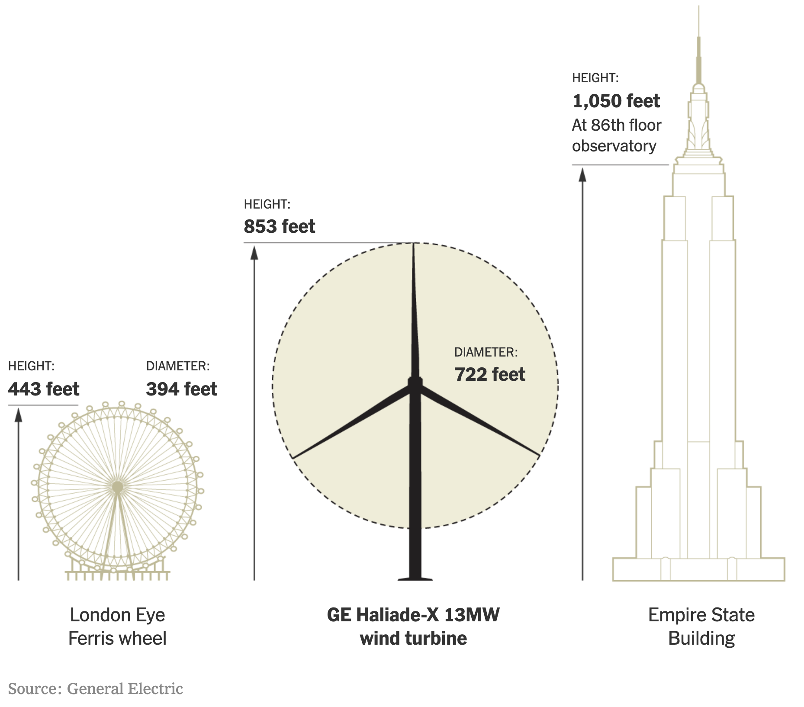

# Reasons for Hope Jan 11 2021 long read: Green US, + products you use and their carbon footprint

<em>Happy New Year, readers! You're receiving this I'm hoping because you *want to keep up to date with the climate crisis*, but <b>want an anxiety-free source of inspiration</b>.</em>

# Read this newsletter if you want inspiration on the climate.
I created [Reasons for Hope](http://reasonsforhope.substack.com) for my own desire to an anxiety-free resource: all the other newsletters were a mixed bag: you'd never know whether you'd end up getting all stressed out by some new misery to worry about. I like to choose the flavours of my chocolates!

<em>If you know of others who might like this, please forward it to them or send them this link. My email newsletter is getting a 70% open rate. I'm pretty astonished: it's almost unheard of in newsletter circles, so you can be confident to recommend it to others resting assured they'll find it a joy to read.</em>

[My video intro to Reasons for Hope](https://www.youtube.com/watch?v=DRzjbd5R0rQ)

# 2021 could turn out to the most hopeful year yet!
I firmly believe 2021 will be seen historically as a huge tipping point for climate change, in a good way. It's definitley a bandwagon to jump on for business & career opportunities as well as investments. 

Here are a few reasons:
* **US will become a prominent force for sustainability with the new administration.**
* **India & China are also accelerating their climate work.** *(Did you know India is one of the few countries that actually met the first 5 year Paris Accord emissions objectives? Also expect to see crazy levels of transformation in China in the coming 5 years as they see being sustainable simply making good economic sense.)* 
* **Climate-friendly policies will continue to be rolled out globally** so that for businesses, climate-friendly also means "just makes business sense"
* **A critical policy is "net zero"**. If a country pledges to be net zero, where does that leave businesses? L'Oreal has one answer (read more below)
* **Huge investment opportunities.** Influenced by these megatrends, we're already seeing in the financial markets the beginning of a huge shift into renewables and sustainability. With banks returning record lows and zero commission trading platforms like Trading 212 there's been an explosion in amateur traders. [Source 1](https://www.cambridgetrust.com/insights/investing-economy/environmental,-social-governance-(esg)-2021-trends) [Source 2](https://www.morningstar.co.uk/uk/news/207432/why-now-is-the-time-for-esg-investing.aspx)
* **Lots of really great sustainability research continue to come through**. Some of it takes years to run and it's great to see things like studies that show [new ways for land to capture CO2](https://flip.it/A4gdpb).  

# Policy: Georgia!

 I mentioned in a previous issue that the "US Senate Georgia runoffs" was an important event on the world stage. 

You don't even need to know what any of those words mean, except to know that, almost unbelievably, it went the way of the climate. I can't emphasise how exciting this is for me. Why?

* US's incoming climate-friendly government will now be able to move much much more smoothly to enact Biden-Harris' $2tn+ green initiatives. 
* What the US does, despite being a fading memory of a superpower, is still hugely influential on the world stage. I say "world stage" a lot because it's through collective action on the world stage that there is hope. 

Pretty exciting way to start 2021!

*Read more*: [Biden's climate goals get greener path as democrats take senate](https://flip.it/mBqDzo)

# Energy: hydrogen, tiny nuclear reactors, wind turbines and Georgia again!

**[Hydrogen heating our homes? Trial in Scotland under way](https://flip.it/rShFup)**. But… Hindenberg? Doesn't hydrogen blow up and kill people? Do we want that in our homes? [Here's a paper on domestic hydrogen heating safety](https://www.sciencedirect.com/science/article/pii/S2095809920302861) (Dec 2020). 

**Hydrogen is actually less flammable than other fuels we use everywhere** in houses and cars, and natural gas infrastructure can be used to transport hydrogen:

> The addition of hydrogen into existing natural gas pipelines is a feasible short-term solution for the following reasons. 
> * **First, an addition of about 10% into natural gas pipelines is technically feasible**, with minor ignition risks, no increase in pipeline fatigue, and no increased leakage risks. 
> * Second, **transporting hydrogen via existing natural gas lines is economically acceptable**, as it can be treated as an alternative way to decrease the overall high construction cost and to save time during the early market-development phase. 
> * Third, the **transportation of flammable gases through existing natural gas pipelines is already accepted by the public.** 
> * Last but not least, the operating practice of such cases will be important in order to explore the further utilization of existing natural gas pipelines

[Georgia, USA first to build an EV-charging solar roadway](https://flip.it/C4UNkM). To be clear, it's in a section of a test track, but it's where such things should be. The French have been leading this. If you followed the hoo-hah about the French solar road last year and how it didn't really work out, well, this is pioneering work. This new iteration uses the same company but with a 21% improvement in efficiency

[Tiny Nuclear Reactors can save American Energy](https://flip.it/g8UImh)

[How big can a wind turbine get?](https://flip.it/z.oEKT) Check out this monster turbine that's 86 stories high. 

# Activism & Litigation: introducing Climate Case Chart

[US court case breaks new ground](https://flip.it/k8dyw6) (well, it did in 2015, and is still ongoing) with this question: 

>"Could the Founding Fathers have imagined that Americans would one day be so impacted by others, that nature would be so degraded, that our own environment threatened pregnancy? How would they have wanted us to react to that threat and our rights to be free from others, and free to live our lives as we see fit, relative to the environmental baseline they enjoyed and extolled as a necessary condition of freedom?" -- led by Earth Guardians

You can track that court case and other [climate court cases on Climate Case Chart](https://flip.it/-CtsLi) that also covers non-US litigation.

Climate Case Chart is both an amazing resource and equally due for a bit of a refresh. To get news of updates is actually a bit of a hunt. I've subscribed now and if you want to then [this is the page](https://us13.list-manage.com/subscribe?u=9906c7202590aac6a8bdbb7b9&id=a721b41b2d).

[100 Solutions to reverse global warming](https://flip.it/jYj3iu) an excellent introduction to Project Drawdown. 

 <em>Project Drawdown is an inspiring reference for the full gamut of climate solutions. [Watch the TED talk intro here](https://flip.it/S.q3Cc) | [Download book for free](https://drawdown.org/the-book)</em>

# Finance & Investment: Prince Charles' £7bn Terra Carta project

[Prince Charles announces "Terra Carta" project](https://flip.it/Cn32Nh) aiming to secure £7bn+ funding. The Prince has been an environmentalist for 50 years. 

More details as they unfold. 
# Transport: the new General (Electric) Motors

[GM moving to huge electric transition](https://flip.it/to.xht). Last issue I talked about how auto manufacturers are panicking because of the tide change in pro-electric, anti-gas policies swelling up across the world. This article is a bit promotional, but it says they're investing $27bn and will have 30 new electric vehicles by 2025. Not to be sneezed at!

# Consumption: L'Oreal, Oysters, Desalination, lab chicken, and vertical farms

How bad are the products you use for the environment? [L'Oreal's brand Garnier makes it easy to find out](https://flip.it/SviptJ). The fashion industry contributes to about 5% of the world's emissions. For comparison, travel is about 2%(!). So it's a sector ripe for change. 

The nirvana is that every product you buy has a carbon footprint, a little like the nutritional information already there in most countries. 

BUT. Buuuuut. It's really hard. Just ask Tesco UK who in 2008 tried to do it. They tried to catalyse the industry to change, but consumer demand wasn't there and it didn't work out to be feasible. [Tesco launches carbon labels (2008)](https://www.theguardian.com/environment/2008/apr/16/carbonfootprints.tesco) | [Tesco retires carbon labels (2012)](https://www.businessgreen.com/blog-post/2142365/miss-tesco-s-carbon-labels). 

Remember how I've been harping on about policy being critical? This is a classic example of why. If the UK govt put in place policies that reflected what Tesco did, there'd have been a level playing field. 

But even then it's not so easy. 

What happens when you try to put carbon labels in place then? Well the EU tried. They ran a pilot over 2013-2016 and there just wasn't the appetite from consumers nor businesses. I had read (link TBD) that Italy was particularly upset about all their meat products being labelled red and how this would impact consumption (kinda thought that was the point…?) [View full 231 page EU Product Environmental Footprint pilot report](https://ec.europa.eu/environment/eussd/smgp/pdf/2018_pilotphase_commreport.pdf)

What's the great news? Recent studies have shown that climate is increasingly of major concern by the public, and as such, introduction of policies may have an easier time than ever before. 

Other consumption news: 

* [Oyster farming could help revitalise the ocean](https://flip.it/JeL.lZ)
* [Desalination brekathrough could lead to cheaper fresh water](https://flip.it/LiPUwJ)
* [Lab-grown chicken nuggets could have worldwide impact](https://flip.it/0oqSDS)
* [2-acre vertical farm managed by robots uses 99% less land](https://flip.it/Gmph2f)

# Waste

* [Banks under scrutiny to look at plastic funding](https://flip.it/64rtN8). 
* [Robot rubbish sorting gets better](https://flip.it/KTMcct) [Video](https://www.youtube.com/watch?v=AT84I1NFU7c)
* [Cow-burp mask could slow down climate change](https://flip.it/H8YMr3). There was a bunch of guffawing sometime back about how cow farts were a big problem. Turns out actually it's mostly from the mouth and nose (95%)
# More thoughts?
Feedback please feel to comment here or mail julian.harris+rfh@gmail.com 

# Now in email form!
This newsletter is part of the LinkedIn Newsletter pilot. If you'd like to get this in your inbox, I also share the newsletter on http://reasonsforhope.substack.com. 

# Postscript