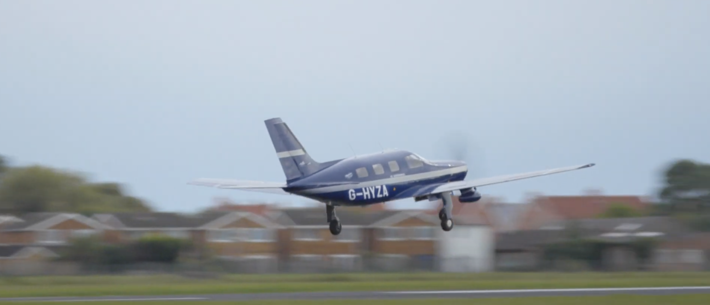

# Reasons for Hope Feb 6, 2021: Mind-blowing: transparent wood, hydrogen, and biofuels everywhere

In this edition I've been brutal with my editing and curation. I ruthlessly slashed and burn the 150+ articles from the past 2 weeks. Staring with steely resolve at my line count, I pressed on, ignoring the squeals of protest from rejected articles virtually surrounding my feet. 

And there we have it. This edition is about just the créme-de-la-créme. Articles that will knock your socks off, that you'll instantly reshare to everyone you know. 

Well. Maybe not. But hopefully, at least one moment where you'll raise an eyebrow a little and say "huh" quietly to yourself before clicking on something else a few seconds later. 

We'll see!

The whole point of my writing is to add some positivity in the world, but *not just a bunch of tra-la koombaya woo woo* but neat stuff of substance that I think will really make things more interesting. 

And finally, I start…

… with some grey paste. Stay with me! This is no ordinary grey paste. It's actually quite exciting grey paste.
# Exciting grey paste

In this new and exciting world we're moving into rapidly, electricity is king.

Currently, there are two main ways to power an electric vehicle: 
* with normal batteries at large scale (Tesla etc), and 
* fuel cell vehicles, which use hydrogen tanks as fuel. 

[Video: how do hydrogen fuel cells work? ](https://www.youtube.com/watch?v=a4pXAmljdUA)

Despite it sounding a bit like packing mini Hindenbergs into your everyday family peoplemover, there are assurances abound that these tanks are safe. And, it's much much quicker to fill up a hydrogen tank than charge up a [500kg battery](https://en.wikipedia.org/wiki/Tesla_Model_S#:~:text=The%2085%20kWh%20battery%20pack,in%20series%20within%20the%20module.). 

But these hydrogen tanks are also big, and have less range. *Enter said paste.*

> "Fraunhofer researchers have presented a magnesium-based "Powerpaste" that stores hydrogen energy at 10 times the density of a lithium battery, offering hydrogen fuel cell vehicles the ability to travel further than gasoline-powered ones, and refuel in minutes."

As for many exciting sustainability developments, 2021 is the year where a lot of sidelined or niche products are now garnering a LOT more attention. 

[View technical details of Powerpaste](https://youtu.be/mK1RjE2r_4s?t=257) (from 2016)

See also 
- [Hydrogenious](https://flip.it/PcXYTZ), another hydrogen fuel innovator, that makes hydrogen infused in oil.

# And now… transparent wood! 

How darned cool is this:

*Transparent wood*. There's something magical about this. It feels space-aged. Like an episode of Star Trek. "But of course we have transparent wood why ever would we not?". 

Here's the article: [Making wood transparent so it can be used for windows](https://flip.it/MCurLt) 
> "The method involves brushing hydrogen peroxide over the surface of the wood, leaving it under a UV light to simulate natural sunlight, before soaking it in ethanol and filling the pores with a clear epoxy.

The resulting material is lighter, stronger, and provides **5x better insulation than glass**.

> The researchers from the University of Maryland said the process alters a structural component of wood called lignin that prevents light from passing through the material.

There you have it. Word of the day: **"lignin"**. Actually, the idea has been around for a few years, but this latest technique is much stronger, cheaper, more aesthetic -- retaining wood grain for some kinds of woods -- and faster to produce.

Read more:
* [Watch a quick mainstream press commentary on transparent wood](https://www.youtube.com/watch?v=CAUN7jsxA14) 
* [Read the academic paper](https://flip.it/qCe5nk)

# Transport: how are we improving the way we travel?

Speaking of hydrogen fuel cells: let's stick 'em in planes too.

[Hydrogen-powered flight ZeroAvia](https://flip.it/bUyWkE):
  
> "In September, ZeroAvia said it completed the first flight of a commercial-grade aircraft powered by hydrogen fuel cells."

Why are hydrogen fuel cells interesting? 

> "If you're working with big planes, batteries are out, Miftakhov said. They're simply too heavy. At the scale Miftakhov is targeting — a 20-seat aircraft that can go 500 miles on one fill — "they would weigh significantly more than the aircraft," he said. Biofuels and synthetic fuels, on the other hand, are just "not as efficient" and come with high maintenance costs, Miftakhov added.
That leaves hydrogen."

[Video: ZeroAvia makes history by flying the largest hydrogen-electric aircraft in the world](https://www.youtube.com/watch?v=h1QQ_TQpGmE)

Despite that skepticism about biofuels, it's not deterring Rolls-Royce. They're [testing 100% sustainable aviation biofuel in small jet engines](https://flip.it/k0tYfS)
> "Sustainable Aviation Fuel is a name the aerospace industry prefers to biofuels. SAFs are produced from a variety of sustainable sources, including municipal solid wastes; cellulose waste from the forestry industry; used cooking oil; energy crops, including comelina, jatropha, halophytes, and algae; and non-biological fuels like waste gases from steel works.
> SAFs are attractive to the aerospace industry because they can address the problem of reducing carbon dioxide emissions immediately. Such fuels can be "dropped in" by simply being added to conventional fuels without the need for extensive changes to existing infrastructure."

So maybe we're looking at sustainable aviation fuel in the shorter term, with planes being run by globs of grey toothpaste a little further down the line? 
# Waste: how are we processing it better than before? 

*Life is short, but plastic is forever*. A French team have come up with a way to take waste plastic and using a process called *pyrolysis* that turns it into a gas, driving a turbine. It can process 3 tonnes of waste an hour! 

And where can you find lots of waste plastic? The sea is full of it: hence the idea of a boat that collects waste plastic and uses it to power the ship. 

> "Yvan Bourgon and his team have designed a yacht which collects plastic garbage from the ocean and then uses it as fuel. It is hoped that a prototype for this design can be launched in 2024. Bourgon has said that if 400 of the boats were to be made, they could clean up one third of the plastic debris in the oceans."

More
* [See a video about The Manta](https://www.youtube.com/watch?v=v6w_niPEClU)
* [Learn about pyrolysis for breaking down plastic](https://www.youtube.com/watch?v=1STaZYZ-P1w)

… and my last recommended article:

[Sustainable glass recycling](https://flip.it/fOpBzo):
Glass bottles are recyclable, but melting them down needs lots of high-emissions energy. Can biofuels help with this too? Encirc thinks so.

*Ever wondered what it looked like at the bottom of that wall that had 10,000 green bottles on it?*

> Encirc has successfully managed to make bottles using renewable biofuels with ultra-low carbon emissions.

> The trial paints a “very bright and sustainable future” for the industry, says Fiacre O’Donnell, head of sustainability at Encirc’s parent company, Vidrala.

> “We’re also looking into the development of hydrogen, and advancements in electric melting to truly discover the future of glass production. These ultra-low-CO2 containers we’re making are being produced for some of the biggest names in the drinks industry.”

See also
- [Reusing plastic to make stronger-than-concrete bricks](https://flip.it/THmC.7) 

# More thoughts?
Feedback please feel to comment here or mail julian.harris+rfh@gmail.com 

# Now in email form!
This newsletter is part of the LinkedIn Newsletter pilot. If you'd like to get this in your inbox, I also share the newsletter on http://reasonsforhope.substack.com. 
